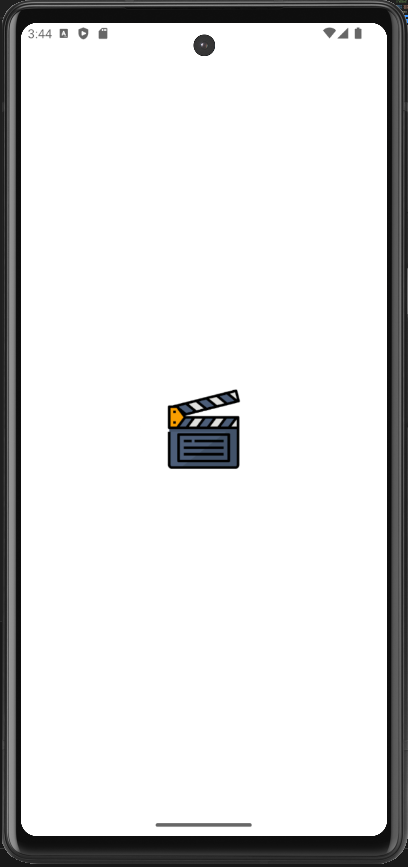
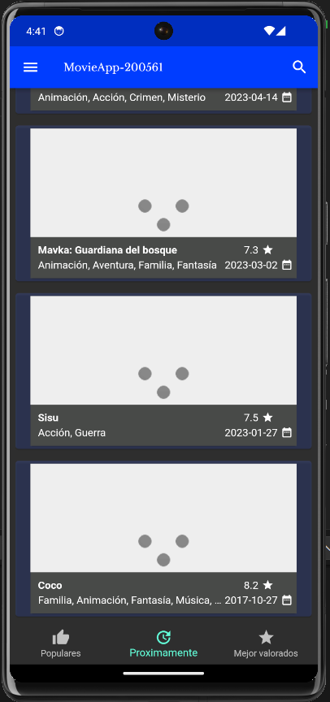
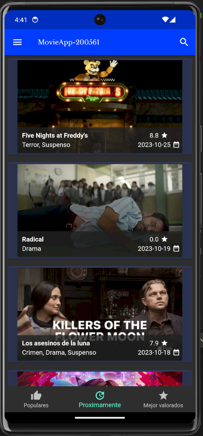
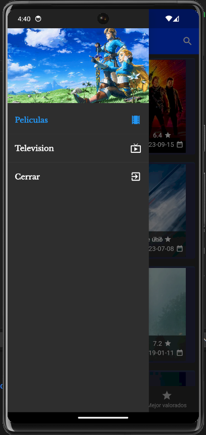
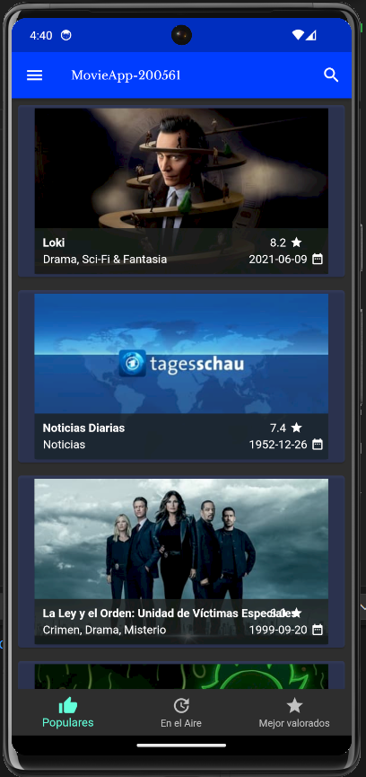
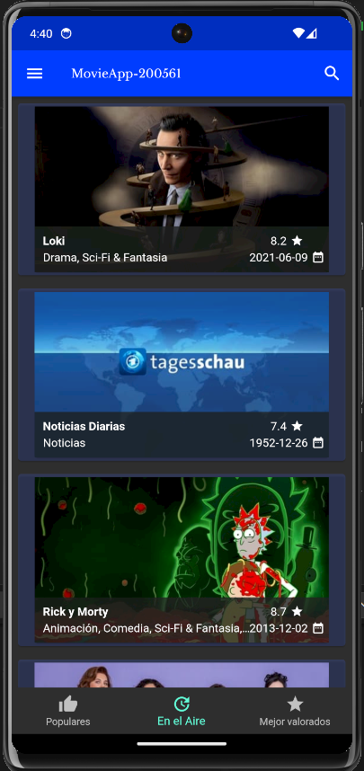
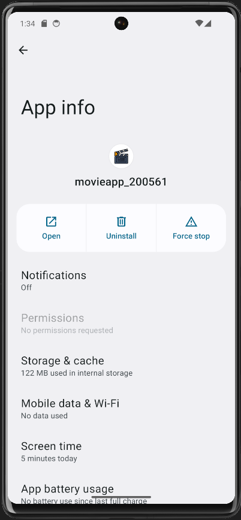

# DMI_Practica13_200561

  
# Universidad Tecnológica de Xicotepec de Juárez

## Ingeniería en Desarrollo y Gestión de Software
## Elisama Arturo Calva Moreno
## 10A
### Desarrollo Móvil Integral

## Capturas de Pantalla

  
  
  
  
  
  
  
  
  
  

&nbsp;
&nbsp;

|  Característica |  Información |
| :------------: | :------------: |
| Nombre  |  Practica 13: Implementación del poster, título, descripción y valoración de película en detalles. |
| Descripción  | Esta aplicación fue creada con Flutter con la finalidad de poder mostrar un ejemplo sencillo de la aplicación que brinda acceso directo a las peliculas y series del momento. Esta aplicación permite explorar un catálogo de expansión y películas, series.Esta aplicacion el el nombre de "MovieAPP," puede acceder a información detallada sobre cada título y sus fechas de lanzamiento. Además, disfrutar de una integración fluida con tus servicios de transmisión preferidos, permitiéndote ver películas y episodios directamente desde la aplicación. Su interfaz de usuario elegante y fácil navegación garantiza una experiencia intuitiva y gratificante. Para este nuevo avance se realizaron mejoras en la app, se agrego una descripción de cada una de las peliculas con  texto justificado y calificación  y fecha correspondiente con una degradación.   |
|  Fecha de Carga | 13/10/23  |

&nbsp;
&nbsp;

&nbsp;
&nbsp;

 
 
 
 

&nbsp;
&nbsp;
